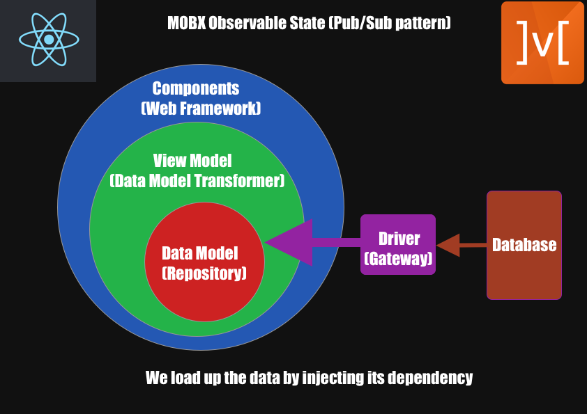

# Mobx State Management in React

<a href="https://dev.to/bronifty/mobx-state-management-in-react-j3c">Blog Post</a>

<a href="https://youtu.be/zNHEPsGPg10">Youtube Video</a>

- Using clean / onion code architecture to extract, transform and load data in a base layer (data model - aka repository), then to broadcast changes to a view model, which is like an aggregate layer (to flatten for presentation). This view model layer then broadcasts to the UI layer, where it is presented in components (React). Streaming changes with pubsub pattern.
